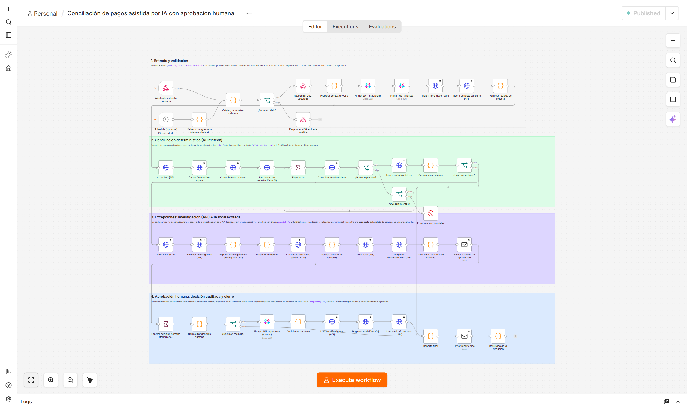

# n8n-ai-reconciliation-workflow

Workflow de **n8n** que automatiza la conciliación de pagos de un extracto bancario contra el libro mayor interno. Las reglas determinísticas concilian. La IA local sólo clasifica y resume las excepciones. **Una persona aprueba o rechaza** cada propuesta, y su decisión queda auditada en la API.

Todo corre en local, con datos **sintéticos** y sin servicios pagos. La validación end-to-end que se describe abajo se ejecutó de verdad, y su evidencia está en [`evidence/`](evidence/).



## El problema

Conciliar un extracto bancario contra el libro mayor es un trabajo repetitivo que tiene excepciones caras:

- montos que no coinciden;
- estados distintos (el banco rechazó un pago que el libro da por cobrado);
- pagos que faltan en una de las dos fuentes.

La parte mecánica conviene automatizarla. Las excepciones requieren criterio humano. La IA puede acelerar la revisión, pero no debe decidir sola sobre dinero.

El workflow reparte ese trabajo así:

1. recibe el extracto por webhook y lo valida;
2. delega la conciliación a reglas determinísticas versionadas (la API);
3. investiga y resume cada excepción con IA acotada, con validación y fallback;
4. pide la decisión a una persona por correo y formulario, y la registra en la API como decisión auditada e idempotente.

## Diagrama del flujo

```mermaid
flowchart LR
  A[Webhook POST<br/>extracto CSV/JSON] --> B{Validar y<br/>normalizar}
  S[Schedule opcional<br/>desactivado] -.-> B
  B -- inválido --> R400[400 con errores]
  B -- válido --> R202[202 + execution_id]
  R202 --> J[JWT dev RS256<br/>integración / analista]
  J --> I[Ingerir libro mayor<br/>y extracto]
  I --> L[Crear lote, cerrar fuentes,<br/>lanzar run rules/v1]
  L --> P{Polling run<br/>máx. N x 1 s}
  P -- timeout --> E1[Stop and Error]
  P -- completado --> X{¿Excepciones?}
  X -- no --> REP
  X -- sí --> C[Abrir caso +<br/>investigación API]
  C --> O[Ollama qwen2.5:7b<br/>JSON Schema]
  O --> V{Validación<br/>de la salida}
  V -- válida --> RC[Propuesta del analista<br/>en la API]
  V -- inválida / caída --> FB[Fallback<br/>determinístico] --> RC
  RC --> M[Correo Mailpit<br/>con enlace firmado]
  M --> W[[Wait: formulario<br/>de aprobación]]
  W --> D[JWT supervisor = revisor<br/>decisión por caso]
  D --> AU[Leer auditoría]
  AU --> REP[Reporte final:<br/>correo + salida]
  ERR[[Error Trigger]] --> EM[Correo sanitizado<br/>a operaciones]
```



El detalle nodo por nodo está en [docs/workflow.md](docs/workflow.md).

## Sistemas integrados

| Sistema | Rol | Cómo se integra |
|---|---|---|
| **n8n Community Edition 2.41.6** (self-hosted, imagen fijada por digest) | Orquestación, Wait con formulario, Error Trigger | `compose.yaml`, en `127.0.0.1:15678` |
| **API de conciliación** ([fintech-ai-reconciliation-agent](https://github.com/manuXD270516/fintech-ai-reconciliation-agent), FastAPI) | Ingesta, reglas `rules/v1`, casos, investigación acotada, decisiones auditadas | HTTP con JWT RS256 de desarrollo. n8n firma los tokens con el nodo JWT y una credencial cifrada |
| **Ollama** (`qwen2.5:7b`, local) | Clasificar cada excepción y redactar un resumen en español | `POST /api/chat` con `format` = JSON Schema, `temperature: 0` |
| **Mailpit v1.31.4** (propio del proyecto) | Correo de aprobación, reporte final y alertas de error | Credencial SMTP de n8n. UI en `127.0.0.1:18825` |
| **Playwright + Chromium** | E2E (el formulario se llena como lo haría una persona), capturas y PDF | `scripts/e2e.mjs`, `scripts/capture.mjs`, `scripts/build-pdf.mjs` |

## Cómo se construyó y qué hice yo

El workflow se construyó con agentes de IA (Claude Code) bajo mi dirección:

- Definí el proceso a automatizar, el alcance y los criterios de aceptación: la IA solo propone, una persona decide y cada decisión queda auditada en la API de conciliación, que es un proyecto propio.
- Dirigí y revisé la implementación: el flujo se diseñó a partir de lo que la API permite de verdad, explorada por OpenAPI y con llamadas de prueba. Tiene 46 nodos funcionales y 4 notas (13 Code, 16 HTTP Request, 3 JWT, 5 If, 2 Wait, 2 Email, 2 Respond to Webhook, Webhook, Schedule y Stop and Error), más un workflow de errores aparte.
- Revisé las decisiones de seguridad y de IA: validación de entrada, polling acotado, prompt con enums restringidos por discrepancia, validador de la salida de la IA (formato, enums, *grounding* de montos y contradicciones), fallback determinístico y redacción de secretos en las alertas.
- Validé el resultado con la corrida end-to-end real (`scripts/e2e.ps1`), con escenarios negativos y verificación independiente en la API y en Mailpit.
- **Hallazgo real:** la corrida e2e encontró un bug en la API (`NEEDS_INFORMATION` responde 500). Quedó documentado con evidencia y el workflow no expone esa opción hasta que se corrija. Ver *Limitaciones*.

## Cómo ejecutarlo

Requisitos:

- Docker Desktop;
- PowerShell 7;
- Node 22+;
- Ollama con `qwen2.5:7b`;
- el stack `recon-m0` de fintech-ai-reconciliation-agent corriendo (API en `127.0.0.1:18180`) y sus claves de desarrollo (`uv run python scripts/dev_auth.py init` en ese proyecto).

```powershell
npm install                      # Playwright 1.63.0 (reutiliza Chromium si ya está instalado)
pwsh scripts/setup.ps1           # crea .env, levanta n8n + Mailpit, owner local, credenciales, workflows
pwsh scripts/e2e.ps1 -SkipSetup  # validación end-to-end real -> evidence/
node scripts/capture.mjs         # capturas -> docs/img/
node scripts/build-pdf.mjs       # deliverables/evidencia-n8n.pdf
```

`setup.ps1` es idempotente, y esto es lo que hace:

1. Genera en `.env` (que git ignora) la clave de cifrado y la contraseña de una cuenta owner **sólo local**.
2. Crea una API key local para el e2e.
3. Arma la credencial JWT a partir de la clave privada de desarrollo de la API. La importa cifrada en n8n y borra el archivo temporal.
4. Importa los workflows con `n8n import:workflow` y los publica.

Disparo manual:

```powershell
Invoke-RestMethod -Method Post http://localhost:15678/webhook/conciliacion/extracto `
  -ContentType application/json -Body (Get-Content fixtures/statement-ok.json -Raw)
# -> 202 {status: accepted, execution_id: ...}; el formulario llega por correo a http://127.0.0.1:18825
```

Contrato del webhook (JSON):

- `statement_id`, `provider_id` (`prov-alfa` | `prov-beta`), `merchant_account`, `currency` (`USD` | `BOB`);
- `window_start`, `window_end`, `cutoff_at` (RFC 3339) y `business_timezone`;
- el extracto en `statement_csv` (CSV) o en `statement` (arreglo JSON);
- el libro mayor en `ledger` o en `ledger_csv`.

## Resultados medidos (corrida e2e real del 2026-10-03)

`node scripts/e2e.mjs`: **43 verificaciones OK, 0 fallidas** ([evidence/e2e-summary.json](evidence/e2e-summary.json)).

| Escenario | Ejecución n8n | Resultado verificado |
|---|---|---|
| A. Camino feliz | **#12** success | 18 transacciones (9 libro + 9 extracto), 10 pagos: **6 EXACT**, **4 excepciones**. **4/4** clasificaciones de Ollama válidas. Formulario llenado con Playwright: **4 decisiones APPROVE** registradas. La API confirma los casos `APPROVED`, el aprobador `reviewer:revisora.demo@example.test` y `decision.record` en la auditoría. Reenviar la decisión con la misma `idempotency_key` devolvió `replayed: true` |
| B. Entradas inválidas | #13–#16 | 400 con errores por campo y fila (campos, CSV sin columnas, ventana invertida, `text/csv`). El JSON ilegible lo corta n8n con 422 antes del workflow. Ninguna ejecución rechazada llamó a la API |
| C. Ollama caído (falla inyectada: puerto cerrado) | **#17** success | 4/4 al fallback determinístico (`ECONNREFUSED`). **REJECT** registrado en 4 casos (`REJECTED` en la API) |
| D. Respuesta inválida del modelo (se le pide texto libre, sin schema) | **#18** success | El validador rechazó 4/4 (`json_invalido`) y entró el fallback. **APPROVE** registrado |
| E. Error de la API (falla inyectada: `batch_id` inválido) | **#19** error, #20 (workflow de errores) success | Falla en `Crear lote (API)` (422). El Error Trigger envió un correo sanitizado a operaciones, sin JWT ni claves |
| F. Inyección deshabilitada | — | `test_fault` rechazado con 400 |

Tiempos del camino feliz (ejecución #12, medidos por el propio workflow):

| Tramo | Tiempo |
|---|---|
| Validación + ingesta | 0,25 s |
| Run en la API | 0,21 s |
| Espera de investigaciones | 4,6 s |
| Clasificación IA (4 excepciones) | 8,9 s |
| **Automatizado total** | **15,4 s** |
| Espera humana (formulario llenado por el e2e) | 2,3 s |
| Total de la ejecución | 17,7 s |

Correos verificados en Mailpit: aprobación (al revisor) y reporte final (al revisor y a operaciones) en cada escenario, más la alerta de error.

Capturas:

- [canvas](docs/img/workflow-canvas.png);
- [ejecución #12 en verde](docs/img/ejecucion-exitosa.png);
- [correo de aprobación](docs/img/email-aprobacion.png);
- [formulario](docs/img/formulario-aprobacion.png);
- [reporte](docs/img/email-reporte.png);
- [alerta de error](docs/img/email-error.png).

## Seguridad y manejo de errores

- **Sin secretos en el repo ni en el JSON exportado:**
  - los workflows referencian credenciales sólo por id;
  - la clave privada vive cifrada en la base de n8n;
  - `N8N_ENCRYPTION_KEY` entra como *secret* de Compose (archivo), así que no es visible para `$env` en los nodos Code;
  - el e2e escanea los JSON exportados en busca de JWT, PEM y contraseñas.
- **JWT de vida corta:** 15 min para los servicios y 10 min para el revisor, y un tenant aislado por ejecución.
- **Segregación de funciones:** propone `svc-n8n-analyst` y decide `reviewer:<correo>`, porque la API rechaza que decida quien propuso.
- **Reintentos acotados:** 3 intentos en las llamadas idempotentes y 2 en Ollama. `Crear lote`, `Lanzar run` y `Proponer recomendación` no se reintentan porque no son idempotentes.
- **Errores:**
  - polling del run con límite y `Stop and Error`;
  - workflow de errores con Error Trigger que redacta JWT, `Authorization` y PEM antes de notificar.

## Limitaciones honestas

- **Datos sintéticos y entorno local:** nada de esto está en producción. Los proveedores, cuentas y montos son ficticios.
- **La IA es un modelo local de 7B:**
  - la calidad de sus causas probables es discutible (por ejemplo, propone `error_de_datos_o_mapeo` para una diferencia de 10.00);
  - por eso sólo produce una **propuesta**: la prioridad la fija una regla y la decisión es humana;
  - la investigación de la API usa su proveedor *scripted* (`SIMULATED`), no un LLM.
- **Validación semántica limitada:** el validador detecta formato, valores fuera de enum, montos inventados y contradicciones obvias, pero no garantiza que el resumen sea correcto. En una iteración anterior el modelo confundió “falta en el banco” con “falta en el libro”. Desde entonces el prompt incluye el significado de cada discrepancia y existe la regla de contradicción.
- **Bug encontrado en la API:** con `NEEDS_INFORMATION`, la API responde 500 (`DataError`).
  - Causa probable: la columna `status` de las recomendaciones es `String(16)` y el valor tiene 17 caracteres.
  - Evidencia: [evidence/hallazgo-api-needs-information.json](evidence/hallazgo-api-needs-information.json), ejecución #10.
  - Mientras tanto, el formulario sólo ofrece Aprobar y Rechazar.
- **Decisión global:** el revisor toma una decisión que se aplica a todas las excepciones de la ejecución. Se registra **por caso**, pero el formulario no permite decidir caso por caso.
- **Fallas inyectadas:** los escenarios “Ollama caído”, “respuesta inválida” y “error de API” se provocan con `test_fault`. Esa opción sólo se acepta con `RECON_FAULT_INJECTION=true`, que el e2e activa y desactiva. No se apagó el Ollama real, que comparten otros proyectos.
- **El Schedule existe pero está desactivado** y no se ejercitó en el e2e.
- **Ejecuciones guardadas con tokens:** los datos de ejecución de n8n guardan los JWT de corta vida en el volumen local. La evidencia exportada los redacta.
- **El Wait expira a las 24 h** y entonces el reporte sale como `NO_DECISION_TIMEOUT`. Ese camino no se ejercitó en el e2e.

## Estructura

```text
compose.yaml              n8n + Mailpit (puertos sólo en 127.0.0.1, volumen propio)
workflows/                JSON exportados e importables (generados por scripts/build-workflow.mjs)
src/nodes/                código de los nodos Code (fuente de verdad)
fixtures/                 extracto sintético de ejemplo
scripts/                  setup.ps1, e2e.ps1/.mjs, capture.mjs, build-pdf.mjs, build-workflow.mjs
evidence/                 resultados JSON de la corrida e2e (sanitizados)
docs/                     workflow.md (nodo por nodo) e img/ (capturas)
deliverables/             evidencia-n8n.pdf y workflow-n8n.json
```

Licencia MIT, © 2026 Manuel Saavedra.
